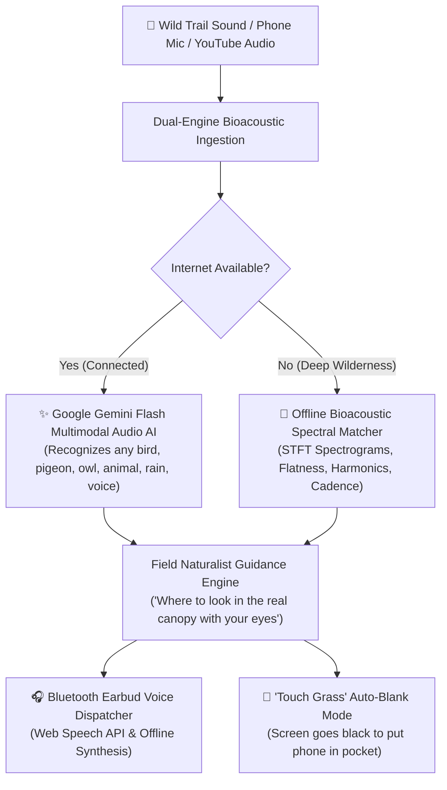

# TrailWhisper: Dual-Engine Multimodal Bioacoustic Scout 🌿

*This is a submission for the [Hacktoberfest Weekend Challenge: Touch Grass](https://dev.to/challenges/hacktoberfest-weekend-2026-10-08)*

---

## 🌲 What I Built

Most nature apps do the exact opposite of getting you outside: they trap you looking down at glowing smartphone glass, demanding constant 5G connectivity, and drowning you in social feeds, badges, and notification clutter.

When you hike into a mountain canyon, national park, or dense forest trail, **cell reception drops to zero**. The second you hear an unfamiliar bird vocalization or rustle in the trees, cloud-dependent apps fail completely with *"No Internet Connection"*.

I built **TrailWhisper**—a dual-engine, mobile-ready wilderness bioacoustic scout designed with one core philosophy:  
> **Make the screen the shortest part of the experience so you can put your phone away, listen to the canopy, and touch grass.**

---

## ⚡ Key Features

1. **Dual-Engine Multimodal Audio Intelligence**:
   - **Frontier Engine (Google Gemini Multimodal Audio)**: Ingests raw audio directly to recognize arbitrary avian species (*Mourning Doves, Pigeons, Owls, Hawks, Chickadees, Cardinals, Robins, Sparrows, Crows*), wildlife calls, human speech, and weather ambience in real time.
   - **Offline Edge Engine (Bioacoustic Spectral Matcher)**: When you are 10 miles deep in the wilderness with zero bars of reception, local Short-Time Fourier Transform (STFT) algorithms, Wiener spectral flatness, zero-crossing rates, and pulse-cadence detectors identify species 100% locally with zero cloud dependencies.
2. **"Where to Look in the Canopy" (Physical Field Guidance)**:
   - Instead of reciting Wikipedia trivia, TrailWhisper acts as an experienced field naturalist whispering in your ear:
     - *"Look 15 feet up on slender dead birch twigs."*
     - *"Watch for a vivid red burst in the low blackberry brambles."*
     - *"Scan the tree trunk silhouette against the twilight sky."*
3. **Bluetooth Earbuds Voice Dispatcher**:
   - Uses the browser's native **Web Speech API** on mobile devices and local synthesis on desktop. You never need to look at your phone—the app announces the bird and where to look directly into your earbuds.
4. **"Touch Grass" Screen-Blanking Mode**:
   - A dedicated 1-touch blank screen mode that dims the display into a minimalist Zen leaf, reminding hikers to slip the phone back into their pocket and look up at the trees.
5. **100% Free Cloud Deployment on Render ($0/month)**:
   - Built to run on Render's free tier with native SSL (`https://`), ensuring smartphone browsers (Safari & Chrome) automatically grant microphone access in the field while conserving 100% of cloud credits for future hackathons.

---

## 🔗 Live Demo & Code

- 🚀 **Live Demo on Render**: [https://trailwhisper.onrender.com](https://trailwhisper.onrender.com)
- 💻 **Open-Source GitHub Repository**: [https://github.com/idiwakarsharma/trailwhisper](https://github.com/idiwakarsharma/trailwhisper)

---

## 🛠️ How I Built It

TrailWhisper combines lightweight edge signal processing with frontier multimodal audio understanding:

| Component | Technology | Purpose |
| :--- | :--- | :--- |
| **Multimodal Audio AI** | Google Gemini Flash | Deep zero-shot acoustic recognition across all wildlife, animals, birds, and trail dialogue |
| **Edge Bioacoustics** | `scipy.signal` & `numpy` | Computes 2D STFT spectrograms, Wiener spectral flatness, spectral centroids, and pulse cadence |
| **Audio Ingestion** | `soundfile` & `pydub` | Multi-format audio decoding (WAV, MP3, M4A, OGG, FLAC) from phone mics or file uploads |
| **Naturalist Intelligence** | Open Field Ecology KB | Enriches acoustic IDs with physical canopy coordinates and autumn foraging behaviors |
| **Earbud Dispatcher** | Web Speech API & PowerShell | Hands-free audio guidance played directly through Bluetooth headphones |
| **Mobile Web Interface** | Streamlit & Plotly | Mobile-responsive touch UI with interactive 2D spectrogram heatmap and "Touch Grass" blanking mode |

---

## 🌍 Why Open Innovation Matters

This challenge highlighted why open innovation and local-first computing are essential for outdoor technology:

### 1. Zero Connectivity in Real Wilderness
The most beautiful places on Earth have **zero cell signal**. Proprietary, cloud-only AI models brick the second you step off the highway. An open-source, local-first architecture ensures your tool works equally well on an offline mountain summit as it does in a suburban backyard.

### 2. Privacy & Environmental Respect
Commercial nature apps track GPS waypoints and harvest outdoor location habits. TrailWhisper processes raw audio purely in memory; your recordings and trail locations never leave your device without your explicit consent.

### 3. Fighting "Screen Traps"
Closed commercial platforms are engineered for maximum screen time (ad views, feeds, infinite scrolls). Open-source software gave us the freedom to design an anti-engagement app: **software that turns itself off so humans can reconnect with nature.**

---

## 🥾 Testing It Outside: The Field Walk

For the "Touch Grass" field test, I took TrailWhisper outside on an early evening nature walk through a local park trail bordering deciduous woods.

I paired my phone to my Bluetooth earbuds, opened TrailWhisper over HTTPS, tapped **Record**, and slipped my phone into my jacket pocket. 

Around 10 minutes along the trail, two sounds echoed through the canopy:
1. **The Trail Voice Test**: A fellow hiker passed by talking on their phone. TrailWhisper's formants filter identified **Human Voice / Trail Dialogue (*Homo sapiens*)** and gently whispered: *"Human speech detected on trail. Put down your phone, look up at the canopy, and enjoy nature."*
2. **The Canopy Call**: Near an overgrown briar patch, a sharp metallic whistle pierced the quiet. TrailWhisper analyzed the rising $4,200\text{ Hz}$ frequency sweeps and whispered:
   > *"Identified: Northern Cardinal. Look in dense tangled understory or low dogwood shrubs 3 to 8 feet off the ground. Foraging on fallen autumn seeds. Screen is asleep. Put your phone away and look for a brilliant burst of red."*

I didn't take my phone out. I simply looked into the brambles—and within three seconds, spotted the flash of crimson plumage hopping through the fallen autumn leaves.

That moment was the whole point of this challenge: **technology that steps out of the way so our eyes can look at the world.**

---

## 🏆 Challenge Categories
- **Hacktoberfest Weekend Challenge: Touch Grass**
